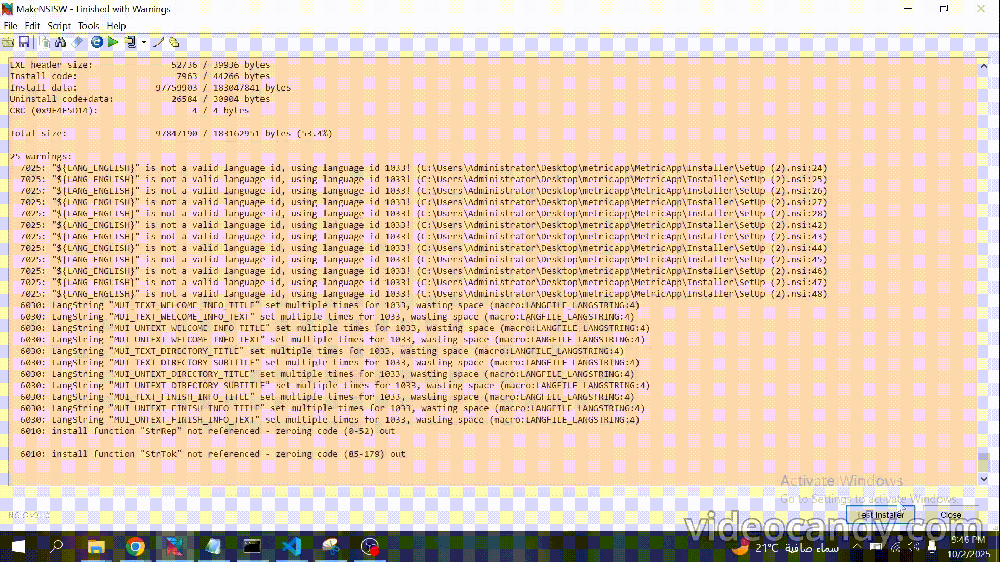
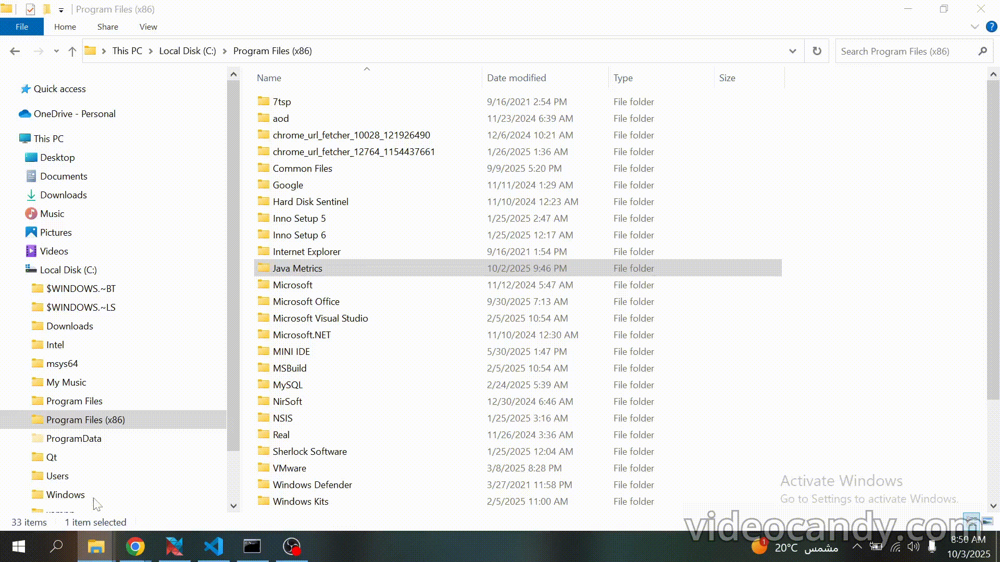
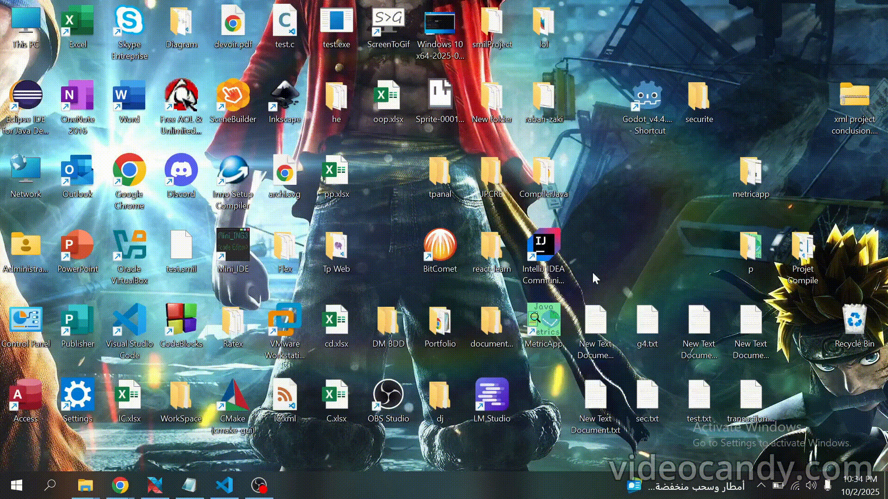
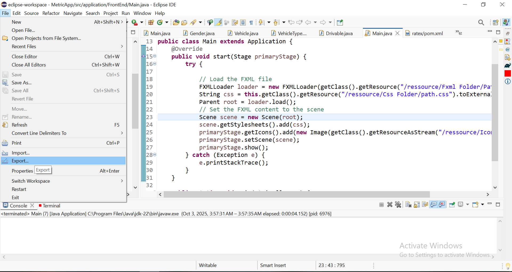
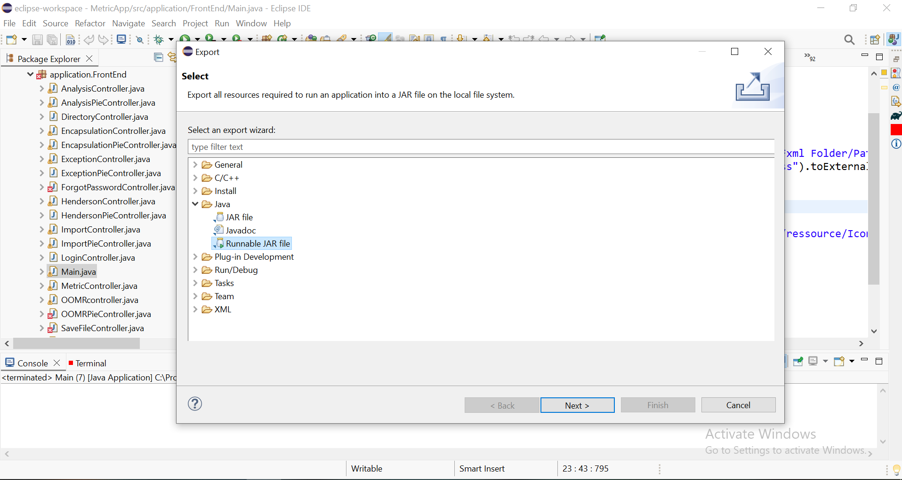
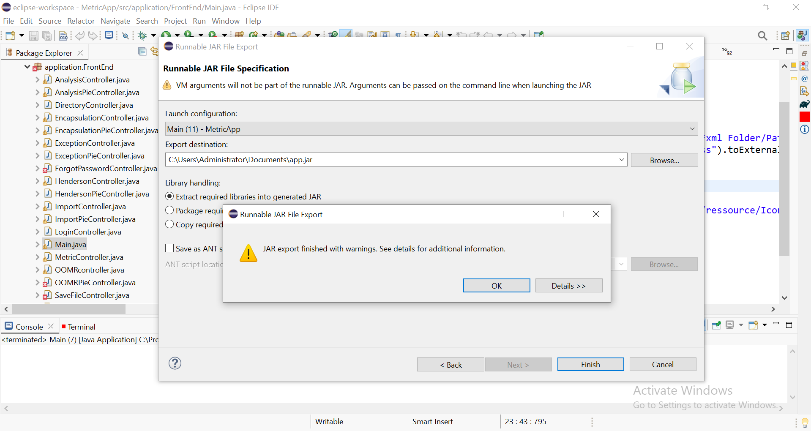
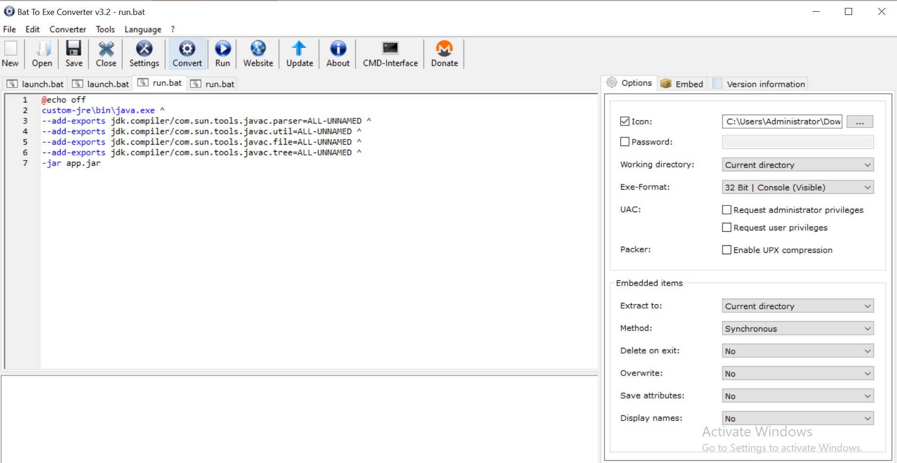
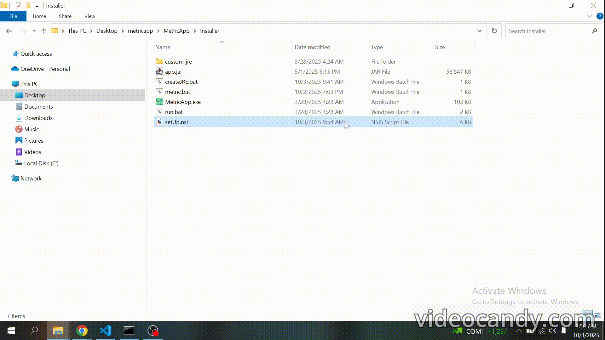

<h1 align="center">
  <br>
 </a>
  <br>
  MetricApp
  <br>
</h1>

<h4 align="center">A <a href="https://openjfx.io/" target="_blank">JavaFX</a> desktop application for static analysis of Java projects, providing detailed code metrics that can be exported to .xlsx file</h4>


<p align="center">
  <a href="#download">Download</a> •
  <a href="#uninstall">Uninstall</a> •
  <a href="#build">Build</a> •
  <a href="#execution">Execution</a> •
  <a href="#bundling-and-distribution-details">Bundling and Distribution Details</a> •
  <a href="#note">Note</a> •
  <a href="#credits">Credits</a> •
  <a href="#license">License</a>
</p>


## Download

You can [download the latest version of the installer](https://github.com/rabah-usthb/MetricApp/releases/tag/v1.0.0) from the [Releases](https://github.com/rabah-usthb/MetricApp/releases) page.

> **Note:**  
> The application is bundled using [`NSIS(Nullsoft Scriptable Install System)`](https://nsis.sourceforge.io/Download) and a custom **JRE** built with [`jlink`](https://docs.oracle.com/en/java/javase/11/tools/jlink.html), so **no additional dependencies are required**.

Currently, **only Windows is supported** since NSIS is dependent on the Windows API.



The gif above shows the process of installation and what happens after executing `MetricsInstaller.exe`.

## Uninstall
You can uninstall the application by running the `Uninstaller.exe` file found in the installation folder.



The gif above shows the process of uninstallation and what happens after executing `Uninstaller.exe`.


## Build

As of now the source code isn't using any build manager tool but in the near future MetricApp will migrate to [`maven`](https://maven.apache.org/).

## Execution

There are three ways to run the program:

- **Desktop Shortcut**:  
  Double-click the shortcut created on your desktop.

- **Start Menu Search**:  
  Press the `Windows` key, search for **MetricApp**, and select it.

- **Command Line**:  
  Open a terminal and type `metric`.




## Bundling and Distribution Details

<pre>
Projects/
├── src/    (source code)
│
├── ReadMeAssets/ (README.md multi-media files) 
│
└── LICENSE
</pre>

In this section we will learn how did we went from source code folder `MetricApp/` to `Installer/` folder.

#### 1. Export The Application As Executable JAR In IDE :

<p align="center">
    
    
</p>

<p align="center">
    
</p>

When we do that it bundles all classes and non-modular `.jar` into one executable `.jar`

#### 2. Create Custom JRE with Jlink :

**CreateJRE.bat :**
```batch
jlink --module-path "C:\Program Files\Java\jdk-22\jmods;C:\Users\Administrator\Downloads\openjfx-21.06_windows-x64_bin-jmods\javafx-jmods-21.0.6" ^
      --add-modules jdk.compiler,java.base,java.desktop,javafx.controls,javafx.fxml,javafx.graphics ^
      --output custom-jre
```
Since we already handled the non-modular `jre`, we now need to bundle a modular custom `jre`.  
To do this, we’ll use the **`jlink`** command, providing the paths to the `jmods` (Java modular files) in this case we have jmods for **Java** and **JavaFX**, specifying the required modules, and setting the output directory for the generated `jre`.

> **Note:**  
> Since all dependencies are bundled, users do not need to have Java or any other dependencies installed.  
> The application uses the custom JRE as its runtime, and all non-modular `jar` files are bundled into the executable `jar`.


#### 3. Create Executables For The Application :

**run.bat :**
```batch
@echo off
custom-jre\bin\java.exe ^
--add-exports jdk.compiler/com.sun.tools.javac.parser=ALL-UNNAMED ^
--add-exports jdk.compiler/com.sun.tools.javac.util=ALL-UNNAMED ^
--add-exports jdk.compiler/com.sun.tools.javac.file=ALL-UNNAMED ^
--add-exports jdk.compiler/com.sun.tools.javac.tree=ALL-UNNAMED ^
-jar app.jar
```

The `run.bat` script uses the `java.exe` executable from the `custom-jre` directory to run the application's executable JAR file, `app.jar`.  
It also includes the necessary `--add-exports` flags to prevent the **Google Formatter** from throwing an `InaccessibleObjectException` due to restricted access to internal JDK modules.

The `run.bat` script represents the **GUI** launch of the application, so we need to convert it into an executable `.exe` file. To do so, we’ll use the [`Bat To Exe Converter (64-bit)`](https://bat-to-exe-converter-x64.en.softonic.com/).

<p align="center">
    
</p>

> **Note:**  
> The icon of the application was made using [`asperite`](https://www.aseprite.org/).


**metric.bat :**
```batch
@echo off
setlocal

set APP_HOME=%~dp0

"%APP_HOME%..\custom-jre\bin\java.exe" ^
  --add-exports jdk.compiler/com.sun.tools.javac.parser=ALL-UNNAMED ^
  --add-exports jdk.compiler/com.sun.tools.javac.util=ALL-UNNAMED ^
  --add-exports jdk.compiler/com.sun.tools.javac.file=ALL-UNNAMED ^
  --add-exports jdk.compiler/com.sun.tools.javac.tree=ALL-UNNAMED ^
  -jar "%APP_HOME%..\app.jar"

endlocal
```

The `metric.bat` script represents the terminal **CLI** launcher of the application, therefore, converting it to an `.exe` file is not necessary. Although it currently launches the **GUI** as well, the CLI functionality is still under development.

The script uses `%~dp0` to expand the full path from the drive letter to the script’s directory, ensuring it can be executed from any location. To make it globally accessible, we will make sure the `nsis` script add its directory to the `PATH` environment variable.


#### 4. Creating NSIS Script :

**setUp.nsi**
```nsis
!undef NSIS_MAX_STRLEN
!define NSIS_MAX_STRLEN 8192

!include "LogicLib.nsh"
!include "StrFunc.nsh"
!include "nsDialogs.nsh"
!include "MUI2.nsh"
!include "FileFunc.nsh"
!include "LogicLib.nsh"
!include "WinMessages.nsh"

${StrStr} 

var AppPath
!define Environ 'HKCU "Environment"'

Name "Java Metrics"
OutFile "metricsInstaller.exe"
InstallDir "$PROGRAMFILES\Java Metrics"


LangString MUI_TEXT_WELCOME_INFO_TITLE ${LANG_ENGLISH} "Welcome to the Installer"
LangString MUI_TEXT_WELCOME_INFO_TEXT ${LANG_ENGLISH} "This wizard will guide you through the installation process."
LangString MUI_TEXT_DIRECTORY_TITLE ${LANG_ENGLISH} "Choose Installation Directory"
LangString MUI_TEXT_DIRECTORY_SUBTITLE ${LANG_ENGLISH} "Specify where the program will be installed."
LangString MUI_TEXT_FINISH_INFO_TITLE ${LANG_ENGLISH} "Congrats You Installed The App Successfully"

!insertmacro MUI_PAGE_WELCOME
!insertmacro MUI_PAGE_LICENSE "..\LICENSE"
!insertmacro MUI_PAGE_DIRECTORY 
!insertmacro MUI_PAGE_INSTFILES


!define MUI_FINISHPAGE_RUN "$AppPath/bin/MetricApp.exe" 
!define MUI_FINISHPAGE_RUN_TEXT "Run App After Closing Installer"
!insertmacro MUI_PAGE_FINISH

LangString MUI_UNTEXT_WELCOME_INFO_TITLE ${LANG_ENGLISH} "Welcome to the Uninstaller"
LangString MUI_UNTEXT_WELCOME_INFO_TEXT ${LANG_ENGLISH} "This wizard will guide you through the uninstallation process."
LangString MUI_UNTEXT_DIRECTORY_TITLE ${LANG_ENGLISH} "Choose The App Directory"
LangString MUI_UNTEXT_DIRECTORY_SUBTITLE ${LANG_ENGLISH} "Specify where the program is installed."
LangString MUI_UNTEXT_FINISH_INFO_TITLE ${LANG_ENGLISH} "Congrats You Uninstalled The App Successfully"
LangString MUI_UNTEXT_FINISH_INFO_TEXT ${LANG_ENGLISH} "You may close the uninstaller now."
LangString MUI_UNBUTTONTEXT_FINISH ${LANG_ENGLISH} "close"

!insertmacro MUI_UNPAGE_WELCOME
!insertmacro MUI_UNPAGE_DIRECTORY
!insertmacro MUI_UNPAGE_INSTFILES
!insertmacro MUI_UNPAGE_FINISH

!insertmacro MUI_LANGUAGE "English"

var programData 

Function setShortCutToStartMenu
    StrCpy $programData "$LocalAppData\Microsoft\Windows\Start Menu\Programs\Java Metrics"
    CreateDirectory "$programData"
    CreateShortcut "$programData\MetricApp.lnk" "$AppPath\bin\MetricApp.exe" "" "$AppPath\bin\MetricApp.exe" "" "" "" "$AppPath"
FunctionEnd

Function createDesktopShortcut
    CreateShortcut "$DESKTOP\MetricApp.lnk" "$AppPath\bin\MetricApp.exe" "" "$AppPath\bin\MetricApp.exe" "" "" "" "$AppPath"
FunctionEnd

Function AddToPath
## implementation
FunctionEnd

Section "Install"

    SetShellVarContext all

    SetOutPath "$INSTDIR" 
    StrCpy $AppPath "$INSTDIR" 
    File "app.jar"
     
    SetOutPath "$INSTDIR\custom-jre"
    File /r "custom-jre\*" 
    SetOutPath "$AppPath"

    SetOutPath "$INSTDIR\bin"
    File "MetricApp.exe"
    File "metric.bat"
    SetOutPath "$AppPath"

    Call setShortCutToStartMenu
    Call createDesktopShortcut
    Push "$AppPath\bin"
    Call AddToPath
    WriteUninstaller "$AppPath\Uninstaller.exe"
    
SectionEnd

Section "Uninstall" 
   SetShellVarContext all
    Delete   "$DESKTOP\MetricApp.lnk"
    RMDIR /r "$LocalAppData\Microsoft\Windows\Start Menu\Programs\Java Metrics"
    RMDIR /r "$INSTDIR"
SectionEnd
```
- **NSIS_MAX_STRLEN**: A constant that defines the maximum string length in NSIS. By default, it's set to only 1024 bytes, which is too small since wew reading large environment variable `PATH`. Therefore, we redefine it to **8192 bytes**.

- **!include** : it just loads dependencies to acess **function and macros**.

- **${StrStr}** : it's a **macros** that finds the first occurrence of a substring in a string , when we do ${macro} it basically makes the call behave like a function (`call macro` instead of typing ` ${macro}`).

- **Name "Java Metrics"** : Assign a title to the window.
- **OutFile "metricsInstaller.exe"** : Set path to the output `.exe` installer file.
- **InstallDir "$PROGRAMFILES\Java Metrics"** : Set the default path of the installation.

- **Modern User Interface (MUI)**: They are **macros** that represent pages, which are the windows of the **GUI**. We can insert them and also modify some areas of text or images. We can also assign a language to it, to learn more you may read the official [documentation](https://nsis.sourceforge.io/Docs/Modern%20UI%202/Readme.html).

- **Function setShortCutToStartMenu**: It creates a shortcut of the **GUI** `MetricApp.exe` launcher in the Program Data folder to make the application accessible through the Windows search bar.

- **Function createDesktopShortcut** : It creates a shortcut of the **GUI** `MetricApp.exe` launcher in the desktop.

- **Function AddToPath**: Adds the installed application's `bin/` folder to the `PATH` environment variable. The implementation is not included here because it's quite long and was taken from the official [documentation](https://nsis.sourceforge.io/Path_Manipulation#Warning). This function safely modifies `PATH`, avoiding corruption or truncation common in other implementations by canceling the procedure if `PATH` is too long.

- **section "install"**: Installs all application files and folders (`custom-jre/`, `bin/`, `app.jar`) to the given path. It also calls the **setShortCutToStartMenu**, **createDesktopShortcut**, and **AddToPath** functions. Finally, it creates the uninstaller in the given path.

- **section "uninstall"**: Uninstalls the application folder and all shortcuts.


#### 5. Compiling The NSIS Script



As we can see after compilation we get an installer executable `metricsIntaller.exe`


## Note
The current version of the software has an issue related to Metrics that require loading `.class` files like the **JEA** metric, which needs to load a `.class` for a custom exception defined in a `.java` file. In such cases, the software must locate the corresponding `.class` file, but the path varies depending on the build tool used in the analyzed project:

- **Maven**: `target/`
- **Gradle**: `build/`
- **Ant**: No standard output folder

Currently, only **Gradle** projects are supported. In a future version, the software will ask the user to also input the folder containing all the compiled java classes, also currently working on a `Advanced-MetricApp` branch to switch to swing flatlaf and miglayout for a more modern UI and will also use JUNIT , and the MVC pattern.


## Credits

This software uses the following open-source languages, tools, and `JAR` libraries:

- [Eclipse](https://eclipseide.org/) : IDE used.
- [Java](https://www.oracle.com/java/technologies/downloads/): Main programming language.
- [JLink](https://docs.oracle.com/en/java/javase/11/tools/jlink.html): Used to create a custom JRE.
- [Bat To Exe Converter (64-bit)](https://bat-to-exe-converter-x64.en.softonic.com/) : Converts `.bat` file into executable `.exe` file.
-  [asperite](https://www.aseprite.org/) : used to create the application icon.
- [NSIS](https://nsis.sourceforge.io/Download): Bundles the application into an installer and uninstaller.
- [JavaFX](https://openjfx.io/): Used to build the **GUI**.
- [Google Java Formatter](https://github.com/google/google-java-format): Code formatting tool.
- [Apache POI](https://poi.apache.org/): Exports metric results to a `.xlsx` file.


## License

GPL3

---
